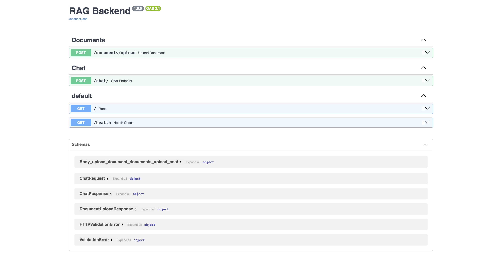
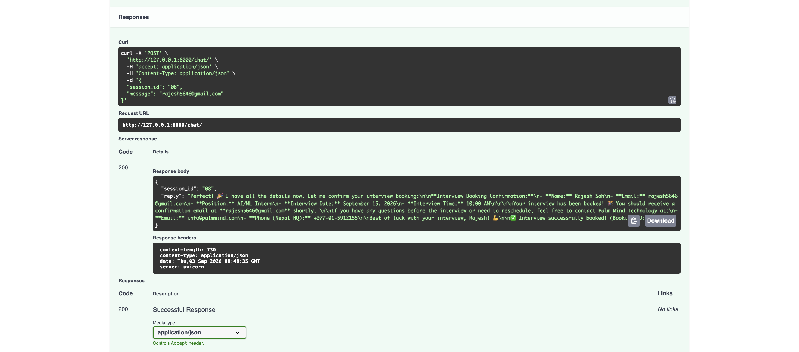
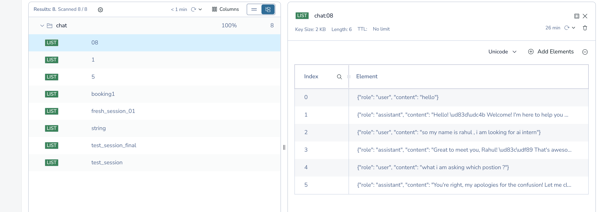
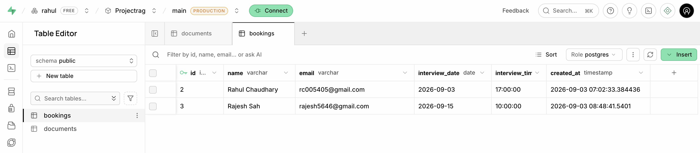

# Document Ingestion & Conversational RAG Backend

Build a FastAPI backend implementing the two required REST services: the **Document Ingestion API** (PDF/TXT extraction, dual chunking, Pinecone indexing) and the **Conversational RAG API** (custom retrieval, Redis multi-turn memory, and LLM-driven interview booking).


---

## What I Built

### 1. Document Ingestion API (`POST /documents/upload`)
- **File Parsing**: Handles `.pdf` (using `pypdf`) and `.txt` files.
- **Two Selectable Chunking Strategies**:
  - `recursive` (default): Recursively splits text using natural separators (`\n\n`, `\n`, `. `, ` `, `""`) to keep coherent paragraphs and sentences together.
  - `fixed`: Splits text into fixed character windows with customizable overlap (default 500 characters, 50 overlap).
- **Embeddings**: Generates normalized 384-dimensional dense vectors locally using `sentence-transformers` with the `BAAI/bge-small-en-v1.5` model.
- **Vector Storage**: Stores vectors and text chunks into **Pinecone** under the configured index and namespace with metadata (`document_id`, `filename`, `chunk_index`, `text`).
- **Database Metadata**: Records document details (`id`, `filename`, `file_type`, `chunking_strategy`, `total_chunks`, `uploaded_at`) into SQL via SQLAlchemy.

### 2. Conversational RAG & Booking API (`POST /chat/`)
- **Custom RAG (No `RetrievalQAChain`)**:
  - User query is embedded using the same `bge-small-en-v1.5` model.
  - Pinecone is queried for the top-k most relevant chunks.
  - Chunks are assembled into a structured context block passed directly into the LLM system prompt.
- **Multi-Turn Memory with Redis**:
  - Chat history is stored in Redis under `chat:<session_id>` as a list of message turns.
  - On each request, prior messages are loaded from Redis and passed in the messages payload to Claude, enabling natural multi-turn conversations.
- **LLM Integration**: Uses Anthropic's Claude (`claude-haiku-4-5-20251001`) via the official `anthropic` Python SDK.
- **Interview Booking Workflow**:
  - The assistant detects booking intent and collects 4 required fields: full name, email, interview date (YYYY-MM-DD), and time (HH:MM).
  - Once all four fields are provided, the model outputs a structured `<booking>` tag containing the JSON data.
  - The backend intercepts the tag, validates it using Pydantic (`BookingCreate`), saves the record into the `bookings` database table, and returns a confirmation with the booking ID.

---






## Tech Stack

- **Framework**: FastAPI + Uvicorn
- **LLM**: Anthropic Claude (`claude-haiku-4-5-20251001`)
- **Embeddings**: `sentence-transformers` (`BAAI/bge-small-en-v1.5`)
- **Vector Database**: Pinecone
- **Memory**: Redis (Redis Cloud / Local Redis)
- **Database / ORM**: SQLite / PostgreSQL via SQLAlchemy 2.0
- **Validation & Settings**: Pydantic v2 & `pydantic-settings`
- **PDF Extraction**: `pypdf`

---

## Project Structure

```text
projectrag/
├── app/
│   ├── api/
│   │   ├── chat.py             # Chat endpoint, multi-turn logic, booking parsing
│   │   └── documents.py        # Upload endpoint (PDF/TXT extraction, chunking, Pinecone indexing)
│   ├── core/
│   │   └── config.py           # Application settings loaded from .env
│   ├── db/
│   │   ├── database.py         # SQLAlchemy engine and session factory
│   │   └── models.py           # ORM models for Document and Booking
│   ├── memory/
│   │   └── redis_memory.py     # Redis session-based conversation manager
│   ├── schemas/
│   │   ├── booking.py          # Pydantic models for interview booking
│   │   ├── chat.py             # ChatRequest and ChatResponse schemas
│   │   └── document.py         # Document upload response schema
│   ├── services/
│   │   ├── booking_service.py  # Service to persist bookings to database
│   │   ├── chunking_service.py # Fixed-size and recursive chunking implementations
│   │   ├── document_service.py # File extraction for PDF and TXT
│   │   ├── embedding_service.py# SentenceTransformers vector generation
│   │   ├── llm_service.py      # Anthropic Messages API client
│   │   └── rag_service.py      # Vector search and prompt context assembly
│   ├── vector_store/
│   │   └── pinecone.py         # Pinecone client for upsert, search, and delete
│   └── main.py                 # FastAPI application entrypoint
├── sample_document.txt         # Sample file for testing ingestion and RAG
├── requirements.txt
├── .env.example
├── .gitignore
└── README.md
```

---

## Getting Started

### 1. Clone the repository and navigate into it
```bash
git clone <your-repo-url>
cd projectrag
```

### 2. Create and activate a virtual environment
```bash
python3 -m venv venv
source venv/bin/activate
```

### 3. Install dependencies
```bash
pip install -r requirements.txt
```

### 4. Configure Environment Variables
Copy `.env.example` to `.env` and fill in your credentials:
```bash
cp .env.example .env
```

Required variables:
```env
ANTHROPIC_API_KEY=your_anthropic_api_key
CLAUDE_MODEL=claude-haiku-4-5-20251001

EMBEDDING_MODEL=BAAI/bge-small-en-v1.5

PINECONE_API_KEY=your_pinecone_api_key
PINECONE_INDEX=rag-documents
PINECONE_NAMESPACE=documents

REDIS_URL=redis://localhost:6379/0  # or your Redis Cloud URL
DATABASE_URL=sqlite:///./rag.db     # or PostgreSQL connection string
```

### 5. Run the server
```bash
uvicorn app.main:app --reload
```
The server will start at `http://127.0.0.1:8000`.

---

## Testing the APIs

Interactive Swagger documentation is available at `http://127.0.0.1:8000/docs`.

### 1. Document Ingestion (`POST /documents/upload`)
Upload a PDF or TXT file using either `recursive` or `fixed` chunking:
```bash
curl -X POST "http://127.0.0.1:8000/documents/upload" \
  -F "file=@sample_document.txt" \
  -F "chunking_strategy=recursive"
```

### 2. Conversational RAG & Booking (`POST /chat/`)

Test a multi-turn conversation using the same `session_id`:

#### Turn 1: Ask a question about the document (RAG Retrieval)
```bash
curl -X POST "http://127.0.0.1:8000/chat/" \
  -H "Content-Type: application/json" \
  -d '{
    "session_id": "session1",
    "message": "What core services and solutions are described in the uploaded document?"
  }'
```

#### Turn 2: Follow-up question (Multi-Turn Redis Memory)
```bash
curl -X POST "http://127.0.0.1:8000/chat/" \
  -H "Content-Type: application/json" \
  -d '{
    "session_id": "session1",
    "message": "Can you elaborate on workflow automation and security standards?"
  }'
```

#### Turn 3: Book an interview (LLM Extraction & SQL Storage)
```bash
curl -X POST "http://127.0.0.1:8000/chat/" \
  -H "Content-Type: application/json" \
  -d '{
    "session_id": "session1",
    "message": "I would like to schedule an interview. My name is Rahul Chaudhary and email is rc005405@gmail.com, and I want to meet on 2026-09-15 at 14:00."
  }'
```
Response will confirm the booking and save the booking in database.
